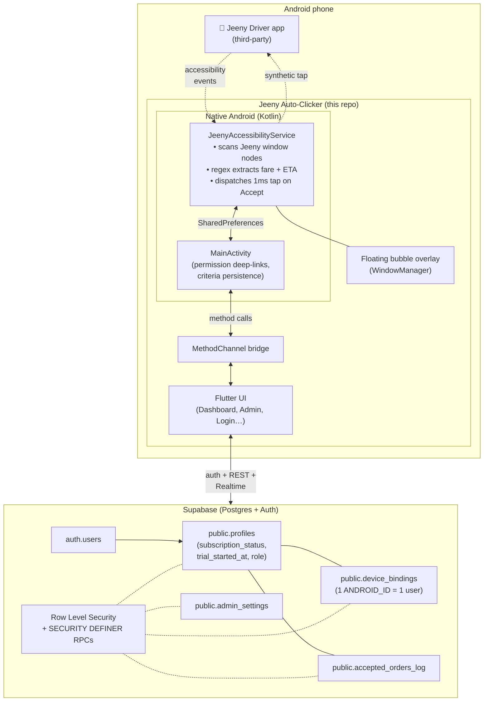

<div align="center">


# Jeeny Auto-Clicker

**Android accessibility-driven auto-accept for Jeeny rideshare drivers.**
Set a minimum fare and maximum pickup time; the app watches the driver
screen and taps *Accept Offer* on qualifying trips — even when it's in
your pocket.

[](https://flutter.dev)
[](https://dart.dev)
[](https://kotlinlang.org)
[](https://supabase.com)
[](https://developer.android.com)
[](LICENSE)
[-orange)](lib/l10n)

</div>

---

## ⚠️ Legal disclaimer

Jeeny Auto-Clicker is an **assistive accessibility tool for drivers**. Automating
interactions with a third-party rideshare app **may violate that platform's
Terms of Service**. Use of this software is at your own risk; the maintainers
accept no responsibility for account suspensions, revenue loss, or any other
consequence arising from its use. Verify local law and platform policy before
deploying to real drivers.

---

## Table of Contents

- [What it does](#what-it-does)
- [Feature highlights](#feature-highlights)
- [Architecture](#architecture)
- [Tech stack](#tech-stack)
- [Prerequisites](#prerequisites)
- [Quick start](#quick-start)
- [Supabase setup](#supabase-setup)
- [Build & run](#build--run)
- [Project structure](#project-structure)
- [How auto-accept works internally](#how-auto-accept-works-internally)
- [Security & privacy](#security--privacy)
- [Roadmap](#roadmap)
- [Contributing](#contributing)
- [License](#license)

---

## What it does

Rideshare drivers routinely lose money accepting orders that are too far
away or too cheap. Jeeny Auto-Clicker solves this by:

1. **Reading the Jeeny driver popup** via Android's Accessibility API
   (regex extraction of fare + pickup ETA, EN + AR + Persian digits).
2. **Comparing the numbers to your criteria** — min-fare slider and
   max-pickup-time slider.
3. **Firing a real 1ms synthetic touch** at the *Accept Offer* button
   coordinates, indistinguishable from a physical tap.
4. **Persisting the accepted trip** to Supabase for the driver's history
   and the admin's overview.

An in-app admin dashboard controls subscriptions (48h free trial → paid
monthly), gated by Postgres Row Level Security.

## Feature highlights

- 🎯 **Filter-driven auto-accept** — min fare + max pickup ETA sliders
- 🌍 **Full EN + AR RTL** localization (system locale by default)
- 💰 **Multi-currency fare parser** — JOD, JD, SAR, AED, EGP, KWD, BHD,
  QAR, IQD, LBP, MAD, SDG + Arabic/Persian digit normalization
- 🫧 **Floating bubble** (green = watching, red = off) — tap from any
  app to toggle
- 📱 **Foreground service** with battery-optimization exemption + OEM
  auto-start deep-links (Xiaomi, Huawei, OPPO, Vivo, Samsung, Realme,
  Honor, Letv)
- 🔒 **Device binding** — one Android device ↔ one account, ever
  (unique `ANDROID_ID`)
- 🧑‍✈️ **Trial + paid subscriptions** — 48h free trial for every new signup,
  30-day paid renewals managed by the admin
- 🛠️ **In-app admin dashboard** — driver list, one-tap activate/extend/
  deactivate, WhatsApp shortcut, revenue overview
- 📖 **Order history** — accepted trips synced to Supabase per driver
- 🔗 **WhatsApp deep-linking** — drivers message the admin with pre-filled
  identity in one tap
- 🔑 **Forgot-password flow** — Supabase magic-link reset
- 📦 **Guided permissions flow** — per-manufacturer accessibility deep-links
  + battery/overlay/auto-start walkthroughs

## Architecture



## Tech stack

| Layer | Technology |
|---|---|
| **UI** | Flutter (Material 3, GoogleFonts, LucideIcons) |
| **State** | ValueNotifier + FutureBuilder (no state-management framework) |
| **i18n** | flutter_localizations + ARB files (auto-generated `AppLocalizations`) |
| **Native** | Kotlin, `AccessibilityService`, `WindowManager` overlay, foreground service |
| **Backend** | Supabase (Postgres 15 + PostgREST + GoTrue) |
| **AuthN/AuthZ** | Supabase Auth + Row Level Security + SECURITY DEFINER RPCs |
| **Persistence** | Server: Postgres. Client: SharedPreferences (Android native) |
| **Icons** | `flutter_launcher_icons` with adaptive-icon foreground/background |
| **Build** | Flutter build APK with `--dart-define-from-file` for secrets |

## Prerequisites

- **Flutter SDK** 3.x (Dart ≥ 3.0)
- **Android Studio** or command-line **Android SDK** with platform-tools (`adb`)
- A **Supabase project** (free tier is fine)
- Physical Android device (API 21+) for real testing — emulators work for UI
  but can't easily exercise the accessibility path

## Quick start

```bash
git clone https://github.com/YOUR_ORG/jeeny-auto-clicker.git
cd jeeny-auto-clicker

# 1. Fill in your Supabase credentials
cp .env.example .env
$EDITOR .env      # set SUPABASE_URL + SUPABASE_ANON_KEY

# 2. Install Flutter deps + generate localizations
flutter pub get

# 3. Regenerate the launcher icons (optional — the current logo already
#    ships in assets/keemo_logo.jpg)
flutter pub run flutter_launcher_icons

# 4. Provision Supabase (once — see next section)
#    Paste the contents of supabase_schema.sql into the Supabase SQL Editor.

# 5. Run on a connected device
flutter run --dart-define-from-file=.env

# — OR — build a release APK
flutter build apk --release --dart-define-from-file=.env
```

The signed release APK lands at:
```
build/app/outputs/apk/release/app-release.apk
```

## Supabase setup

1. **Create a project** at [supabase.com](https://supabase.com) and copy the
   project URL + anon key into `.env`.
2. **Run the schema** — open the SQL Editor and paste all of
   [`supabase_schema.sql`](supabase_schema.sql). Safe to re-run; it's idempotent.
3. **(Recommended) Enable `pg_cron`** in *Database → Extensions*, then run
   once to auto-flag expired trials/subs every 15 minutes:
   ```sql
   SELECT cron.schedule(
       'expire_stale_subs', '*/15 * * * *',
       $$SELECT public.expire_stale_subscriptions();$$
   );
   ```
4. **Disable email confirmation** in *Auth → Providers → Email* so drivers
   can log in the moment they sign up (otherwise the trial doesn't start
   until they click a verification email).
5. **Promote yourself to admin** — sign up in the app first, then in the
   Supabase SQL Editor:
   ```sql
   SELECT public.promote_self_to_admin_bootstrap();
   ```
   That RPC only works while there are zero admins (safe bootstrap).
6. **Set your WhatsApp number** in the app's *Admin Dashboard → Settings*
   tab so drivers can message you for activation.

For local development you also have:
- [`supabase_debug.sql`](supabase_debug.sql) — inspection / reset queries
- [`supabase_seed_test_drivers.sql`](supabase_seed_test_drivers.sql) — creates
  four fake drivers in different subscription states so you can exercise the
  admin UI without real signups

## Build & run

```bash
# Debug run on connected device
flutter run --dart-define-from-file=.env

# Release APK (universal)
flutter build apk --release --dart-define-from-file=.env

# Release APK, split per ABI (smaller downloads)
flutter build apk --release --split-per-abi --dart-define-from-file=.env

# Install via adb (skips Play Protect + unknown-sources prompts)
adb install -r build/app/outputs/apk/release/app-release.apk
```

Non-technical drivers can follow the sideload guides in
[`INSTALL_EN.md`](INSTALL_EN.md) or [`INSTALL_AR.md`](INSTALL_AR.md).

## Project structure

```
├── android/                         Native Android (Kotlin)
│   └── app/src/main/kotlin/com/example/keemo/
│       ├── MainActivity.kt          Method-channel bridge + permission intents
│       └── JeenyAccessibilityService.kt
│                                    Screen scanning, matching, click cascade,
│                                    floating bubble overlay, foreground service
│
├── lib/                             Flutter (Dart)
│   ├── main.dart                    App entry + AuthGate routing
│   ├── core/
│   │   ├── config/env.dart          --dart-define reader
│   │   ├── constants/app_colors.dart
│   │   ├── services/
│   │   │   ├── supabase_service.dart      All Supabase calls + RPCs
│   │   │   ├── native_bridge.dart         MethodChannel wrappers
│   │   │   └── localization_service.dart  Locale persistence
│   │   ├── utils/device_info_util.dart    ANDROID_ID resolver
│   │   └── widgets/language_toggle_button.dart
│   ├── features/
│   │   ├── auth/                    Login, Register, Forgot Password
│   │   ├── dashboard/               Driver Dashboard + widgets + drawer
│   │   ├── admin/                   Admin Dashboard (Drivers/Overview/Settings)
│   │   ├── permissions/             Permissions guide + OEM accessibility sheet
│   │   └── subscription/            Inactive / trial-expired screen
│   └── l10n/                        ARB files (en/ar) + generated bindings
│
├── supabase_schema.sql              Full DDL — tables, RLS, triggers, RPCs
├── supabase_debug.sql               Ad-hoc inspection queries
├── supabase_seed_test_drivers.sql   Test-fixture drivers
├── INSTALL_EN.md / INSTALL_AR.md    Driver-facing sideload guides
├── .env.example                     Credentials template
└── pubspec.yaml
```

## How auto-accept works internally

<details>
<summary>Click to expand — the full click pipeline</summary>

1. **System filter** (`accessibility_service_config.xml`) —
   `android:packageNames="me.com.easytaxista,com.android.chrome"` means Android
   only forwards events from Jeeny's driver app (`me.com.easytaxista`) plus
   Chrome (for the HTML test mock at `jeeny-mock.html`).
2. **Event types** — we subscribe to `typeWindowStateChanged`,
   `typeWindowContentChanged`, and `typeWindowsChanged`. The last one is
   essential for catching popup windows.
3. **Root gathering** — we combine `rootInActiveWindow`, `event.source`
   walked up to its root, AND every visible window's root. Jeeny's order
   popup can be rendered in a separate window from the main app.
4. **Text scrape** — DFS over the tree collecting `.text` and
   `.contentDescription` for regex extraction.
5. **Normalization** — Arabic-Indic digits (٠-٩), Persian digits (۰-۹),
   Arabic decimal separator (٫), non-breaking spaces, diacritics — all
   normalized to Western equivalents before matching.
6. **Fare + pickup extraction** — 12 currency-specific patterns tried in
   order, then a contextual fallback (`fare|price|أجرة|سعر ...`). Pickup
   time same idea but for minutes.
7. **Context gate** — only run the click cascade if the screen also
   contains order-indicator words like `Accept`, `قبول`, `pickup`, `طلب`.
   Prevents false positives on the wallet balance / notification bar.
8. **Criteria check** — `fare ≥ minFare` AND `pickup ≤ maxPickupMins`.
9. **Button match** — case-insensitive substring search for any of ~20
   accept-button labels (English + Arabic) OR any node whose
   `viewIdResourceName` contains keywords like `accept_button`,
   `btn_accept`, `accept_offer`.
10. **Click strategy** — priority ladder: (a) `ACTION_CLICK` on the found
    node if `isClickable`, (b) walk up 10 ancestors looking for a
    clickable one, (c) `ACTION_CLICK` on the node itself, (d)
    `dispatchGesture` with a **1-millisecond** stroke at the clickable
    ancestor's center coordinates. That 1ms figure came from
    reverse-engineering an existing app in the same space — longer
    durations get interpreted as long-press by some touch handlers.
11. **Debounce** — 800ms between successful clicks so we don't spam.
12. **Persistence** — write to SharedPreferences (for the Dashboard's
    "Recent Activity" card) AND append to a pending queue that the
    Dashboard drains into Supabase's `accepted_orders_log` on its next
    3-second refresh tick.

</details>

## Security & privacy

- **No hard-coded credentials.** Supabase URL + anon key come from
  `--dart-define-from-file=.env`. `.env` is git-ignored.
- **RLS on every table.** Drivers can only see their own row; admins
  can see all. Anonymous callers get nothing.
- **All admin RPCs check `public.is_admin()`** server-side before doing
  anything. The client can't spoof its way past.
- **`SECURITY DEFINER` functions all set `search_path = public`** to
  block search-path hijacking attacks.
- **Device binding is one-way** — an account is locked to the
  `Settings.Secure.ANDROID_ID` of the phone it was created on. Admin
  can reset via `reset_user_device_binding`.
- **Accessibility scope is narrow** — the service only receives events
  from Jeeny's driver package (system-level filter in the XML config).
  It cannot read your bank app, WhatsApp messages, or anything else.
- **No telemetry, no analytics, no third-party trackers.** Only outbound
  network calls are to your own Supabase project + WhatsApp / OEM
  settings pages via `Intent`.

See [SECURITY.md](SECURITY.md) for how to report a vulnerability.

## Roadmap

- [ ] iOS support (Apple's accessibility API is far more restrictive —
      probably impossible without jailbreak)
- [ ] Multi-app support: Careem, InDriver, Yango, Bolt driver apps
- [ ] Optional Supabase Realtime subscription to replace the InactiveSubScreen
      auto-refresh polling
- [ ] In-app subscription payments via Stripe/PayPal (currently manual +
      WhatsApp)
- [ ] Admin push notifications on new signup / new activation requests
- [ ] Time-of-day / geofence-based criteria (e.g. "min 8 JD after 10pm")

## Contributing

PRs welcome. Before opening one:

1. Fork + branch off `main`
2. `flutter analyze` should be clean (or only info-level deprecations)
3. Test on a real Android device — the accessibility service can't
   really be unit-tested
4. If your change touches SQL, keep `supabase_schema.sql` idempotent
5. Sign your commits and describe the actual driver-side behavior change

Bug reports: please include the accessibility service logcat output —
`adb logcat -s JeenyAccessibility`.

## License

Released under the [MIT License](LICENSE). You are free to use, modify,
and distribute this software. See the [Legal disclaimer](#-legal-disclaimer)
at the top of this README before deploying to real drivers.
