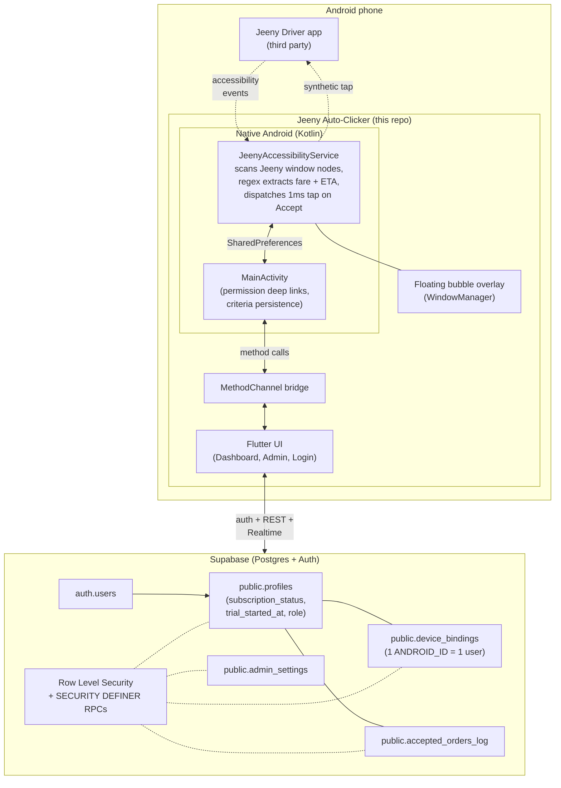

<div align="center">


# Jeeny Auto-Clicker

An Android accessibility driven auto accept assistant for Jeeny rideshare drivers. The driver sets a minimum fare and maximum pickup time. The app watches the driver screen and taps *Accept Offer* on qualifying trips, even when the phone is in a pocket.

[](https://flutter.dev)
[](https://dart.dev)
[](https://kotlinlang.org)
[](https://supabase.com)
[](https://developer.android.com)
[](LICENSE)
[-orange)](lib/l10n)

</div>

---

## Legal disclaimer

Jeeny Auto-Clicker is an assistive accessibility tool for drivers. Automating interactions with a third party rideshare app may violate that platform's Terms of Service. Use of this software is at your own risk. The maintainers accept no responsibility for account suspensions, revenue loss, or any other consequence arising from its use. Verify local law and platform policy before deploying to real drivers.

## Religious disclaimer

This product has not been reviewed for compliance with Islamic Shariah law. Its permissibility under Shariah is neither claimed nor implied. Any use is entirely the user's responsibility, and consultation with a qualified scholar is recommended for those to whom this matters.

## What it does

Rideshare drivers routinely lose money accepting orders that are too far away or too cheap. Jeeny Auto-Clicker addresses this in four steps:

1. Reads the Jeeny driver popup through Android's Accessibility API, extracting fare and pickup ETA in English, Arabic, and Persian digits.
2. Compares the extracted numbers to criteria set by the driver: a minimum fare slider and a maximum pickup time slider.
3. Fires a real 1ms synthetic touch at the *Accept Offer* button coordinates, indistinguishable from a physical tap.
4. Persists the accepted trip to Supabase for the driver's history and the admin's overview.

An in app admin dashboard controls subscriptions (48h free trial, then a paid monthly plan), all gated by Postgres Row Level Security.

## Feature highlights

* Filter driven auto accept using a min fare slider and a max pickup ETA slider
* Full English and Arabic RTL localization, defaulting to the system locale
* Multi currency fare parser covering JOD, JD, SAR, AED, EGP, KWD, BHD, QAR, IQD, LBP, MAD, SDG, plus Arabic and Persian digit normalization
* Floating bubble (green when watching, red when off) that toggles from any app
* Foreground service with battery optimization exemption and OEM auto start deep links (Xiaomi, Huawei, OPPO, Vivo, Samsung, Realme, Honor, Letv)
* Device binding so one Android device maps to one account for its lifetime, using the unique `ANDROID_ID`
* Trial and paid subscriptions, with a 48 hour free trial for every new signup and 30 day paid renewals managed by the admin
* In app admin dashboard with a driver list, one tap activate/extend/deactivate, a WhatsApp shortcut, and a revenue overview
* Order history synced to Supabase per driver
* WhatsApp deep linking so drivers message the admin with pre filled identity in one tap
* Forgot password flow via Supabase magic link reset
* Guided permissions flow with per manufacturer accessibility deep links and battery/overlay/auto start walkthroughs

## Architecture



## Tech stack

| Layer | Technology |
|---|---|
| UI | Flutter (Material 3, GoogleFonts, LucideIcons) |
| State | ValueNotifier and FutureBuilder, no state management framework |
| i18n | flutter_localizations with ARB files, generating `AppLocalizations` |
| Native | Kotlin, `AccessibilityService`, `WindowManager` overlay, foreground service |
| Backend | Supabase (Postgres 15 + PostgREST + GoTrue) |
| AuthN and AuthZ | Supabase Auth with Row Level Security and SECURITY DEFINER RPCs |
| Persistence | Server side Postgres, client side SharedPreferences (Android native) |
| Icons | `flutter_launcher_icons` with adaptive icon foreground and background |
| Build | Flutter build APK with `--dart-define-from-file` for secrets |

## Download

The signed release APK is attached to the [latest GitHub Release](../../releases/latest). Non technical drivers can follow the sideload guides in [INSTALL_EN.md](INSTALL_EN.md) or [INSTALL_AR.md](INSTALL_AR.md) after downloading.

## Project structure

```
.
├── android/                                Native Android (Kotlin)
│   └── app/src/main/kotlin/com/example/keemo/
│       ├── MainActivity.kt                 Method channel bridge, permission intents
│       └── JeenyAccessibilityService.kt    Screen scanning, matching, click cascade,
│                                           floating bubble overlay, foreground service
│
├── lib/                                    Flutter (Dart)
│   ├── main.dart                           App entry, AuthGate routing
│   ├── core/
│   │   ├── config/
│   │   │   └── env.dart                    Reads --dart-define values at build time
│   │   ├── constants/app_colors.dart
│   │   ├── services/
│   │   │   ├── supabase_service.dart       All Supabase calls and RPCs
│   │   │   ├── native_bridge.dart          MethodChannel wrappers
│   │   │   └── localization_service.dart   Locale persistence
│   │   ├── utils/
│   │   │   └── device_info_util.dart       ANDROID_ID resolver
│   │   └── widgets/
│   │       └── language_toggle_button.dart
│   ├── features/
│   │   ├── auth/                           Login, Register, Forgot Password
│   │   ├── dashboard/                      Driver Dashboard, widgets, drawer
│   │   ├── admin/                          Admin Dashboard (Drivers, Overview, Settings)
│   │   ├── permissions/                    Permissions guide, OEM accessibility sheet
│   │   └── subscription/                   Inactive and trial expired screen
│   └── l10n/                               ARB files (en, ar), generated bindings
│
├── supabase_schema.sql                     Full DDL: tables, RLS, triggers, RPCs
├── supabase_debug.sql                      Ad hoc inspection queries
├── supabase_seed_test_drivers.sql          Test fixture drivers
├── INSTALL_EN.md, INSTALL_AR.md            Driver facing sideload guides
├── .env.example                            Credentials template
└── pubspec.yaml
```

## How auto-accept works internally

<details>
<summary>Click to expand: the full click pipeline</summary>

1. System filter (`accessibility_service_config.xml`): `android:packageNames="me.com.easytaxista,com.android.chrome"` means Android only forwards events from Jeeny's driver app (`me.com.easytaxista`) plus Chrome (for the HTML test mock at `jeeny-mock.html`).
2. Event types: the service subscribes to `typeWindowStateChanged`, `typeWindowContentChanged`, and `typeWindowsChanged`. The last one is essential for catching popup windows.
3. Root gathering: combine `rootInActiveWindow`, `event.source` walked up to its root, and every visible window's root. Jeeny's order popup can be rendered in a separate window from the main app.
4. Text scrape: DFS over the tree collecting `.text` and `.contentDescription` for regex extraction.
5. Normalization: Arabic Indic digits, Persian digits, Arabic decimal separator, non breaking spaces, and diacritics are all normalized to Western equivalents before matching.
6. Fare and pickup extraction: 12 currency specific patterns tried in order, then a contextual fallback (`fare|price|أجرة|سعر ...`). Pickup time uses the same idea but for minute variants.
7. Context gate: only run the click cascade if the screen also contains order indicator words such as `Accept`, `قبول`, `pickup`, `طلب`. Prevents false positives on the wallet balance or notification bar.
8. Criteria check: `fare >= minFare` AND `pickup <= maxPickupMins`.
9. Button match: case insensitive substring search for any of roughly 20 accept button labels (English and Arabic) OR any node whose `viewIdResourceName` contains keywords like `accept_button`, `btn_accept`, `accept_offer`.
10. Click strategy: a priority ladder. First `ACTION_CLICK` on the found node if `isClickable`. Then walk up 10 ancestors looking for a clickable one. Then `ACTION_CLICK` on the node itself. Finally `dispatchGesture` with a 1 millisecond stroke at the clickable ancestor's center coordinates. Longer durations get interpreted as long press by some touch handlers.
11. Debounce: 800ms between successful clicks so the service does not spam.
12. Persistence: write to SharedPreferences for the Dashboard's Recent Activity card, and append to a pending queue that the Dashboard drains into Supabase's `accepted_orders_log` on its next 3 second refresh tick.

</details>

## License

Released under the [MIT License](LICENSE). Please re read the legal and religious disclaimers above before deploying to real drivers.
